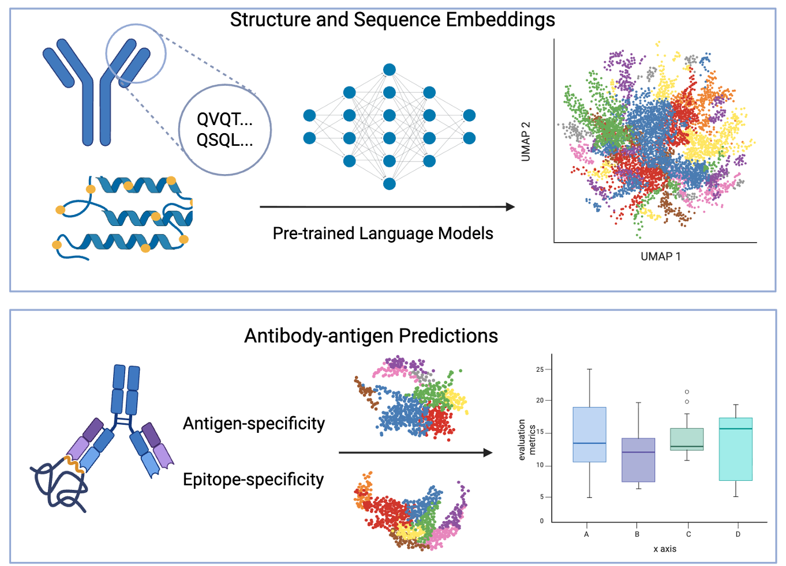

# Structure Embedding for BCR Analysis

## Overview

This repository implements and compares structural embedding methods for B-cell receptor (BCR) analysis. The pipeline evaluates two structure prediction frontends (IgFold and ImmuneBuilder/ABodyBuilder2) combined with three structure embedding methods (SPACE2, Protein Holography, and AntiBERTa2-CSSP) for BCR specificity prediction tasks.

## Key Features

- **Two Structure Prediction Frontends**: IgFold and ImmuneBuilder (ABodyBuilder2) for antibody structure generation
- **Three Structure Embedding Methods**: SPACE2, Protein Holography, and AntiBERTa2-CSSP implementations
- **Comprehensive Comparison**: Systematic evaluation of frontend-backend combinations
- **Performance Analysis**: Benchmarking against existing structural algorithms for speed and accuracy
- **BCR Specificity Prediction**: Evaluation on SARS-CoV-2 spike protein binding datasets

## Main Components

### Core Scripts
- `unified_structure_embedding.py` - Main pipeline for structural embedding generation
- `generate_real_structure_embeddings.py` - Generate embeddings using real structural data
- `real_space2_method.py` - SPACE2 method implementation
- `real_protein_holography.py` - Protein holography approach
- `real_antiberta2_cssp_method.py` - AntiBERTa2 CSSP method

### Data
- `data/` - Contains processed datasets and results
  - `bcr_airr_dataset.tsv` - Specificity prediction results (too big to upload)
  - `bcr_airr_complete_dataset.tsv` - Complete dataset with all sequences (too big to upload)
  - `processed_cao_dataset.csv` - Main evaluation dataset
  - Various comparison and analysis files

